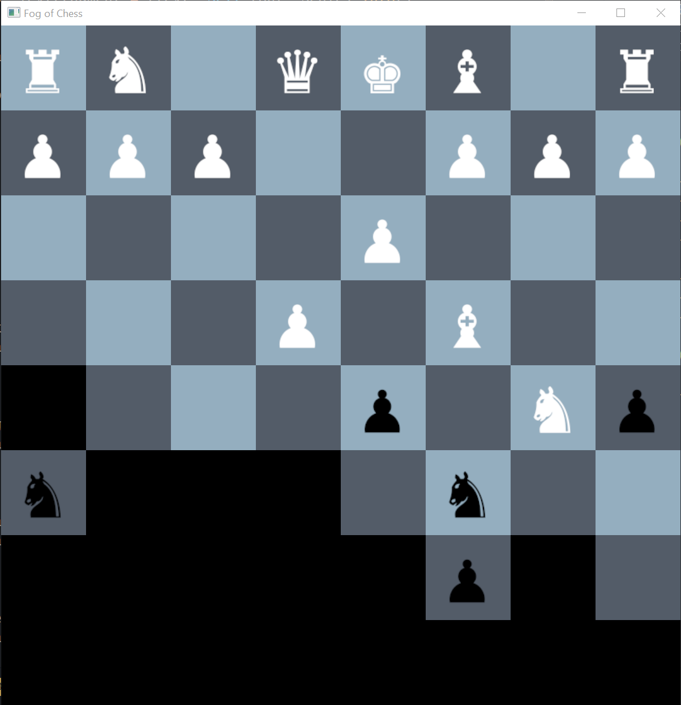

# Fog Of Chess

A prototypical chess game where the fog of war is thick.
You must be careful how you advance and be sure to gain as much sight as possible.
Information is power.

Written in Rust using [ggez](https://github.com/ggez/ggez).

```
git clone https://github.com/jackmordaunt/fog-of-chess
cd fog-of-chess
cargo run --release
```



## Features

- [x] Single unit movement.
- [x] Basic line of sight based on move-set and adjacent positions.
- [ ] Compound movements such as the castle move.
- [ ] Win condtions (currently player-enforced), check and check-mate.
    - Win screen with player, button to restart.
- [ ] Networked multiplayer.
- [x] Fog Toggle.
- [ ] HUD (display current player turn, timer, menu to change game states).

## Backlog

- [ ] Auto-center pieces.
